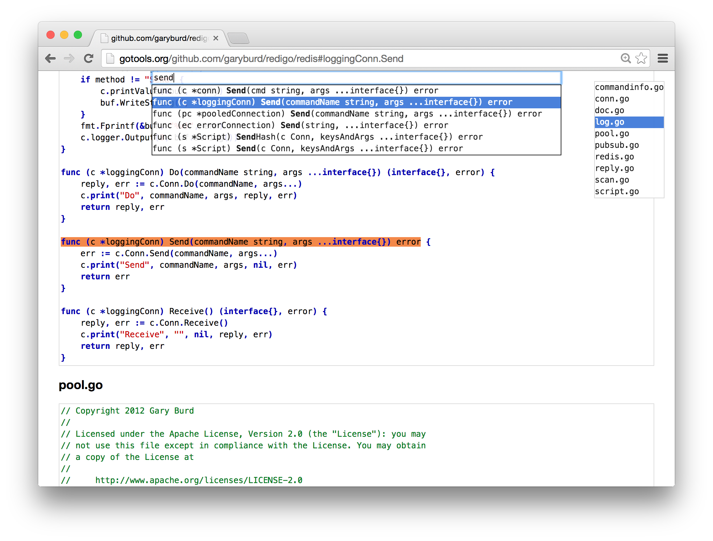

# gtdo [](https://travis-ci.org/shurcooL/gtdo) [](https://godoc.org/github.com/shurcooL/gtdo)

gtdo is the source for [gotools.org](http://gotools.org/).



Installation
------------

```bash
go get -u github.com/shurcooL/gtdo
```

Development
-----------

This package relies on `go generate` directives to process and statically embed assets. For development only, you'll need extra dependencies:

```bash
go get -u -d -tags=generate github.com/shurcooL/gtdo/...
GOARCH=js go get -u -d github.com/shurcooL/gtdo/...
```

Afterwards, you can build and run the package in development mode, where all assets are always read and processed from disk:

```bash
go build -tags=dev github.com/shurcooL/gtdo
```

When you're done with development, you should run `go generate` before committing:

```bash
go generate github.com/shurcooL/gtdo/...
```

License
-------

-	[MIT License](https://opensource.org/licenses/mit-license.php)
